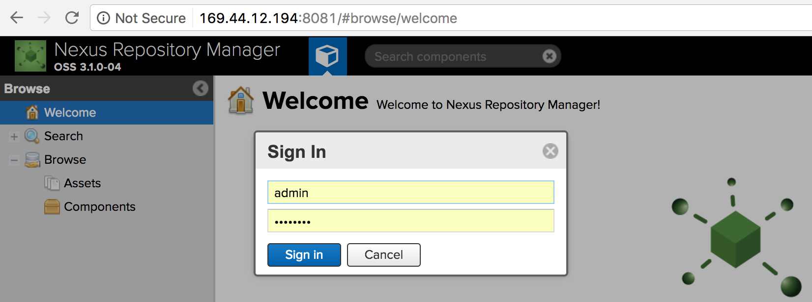
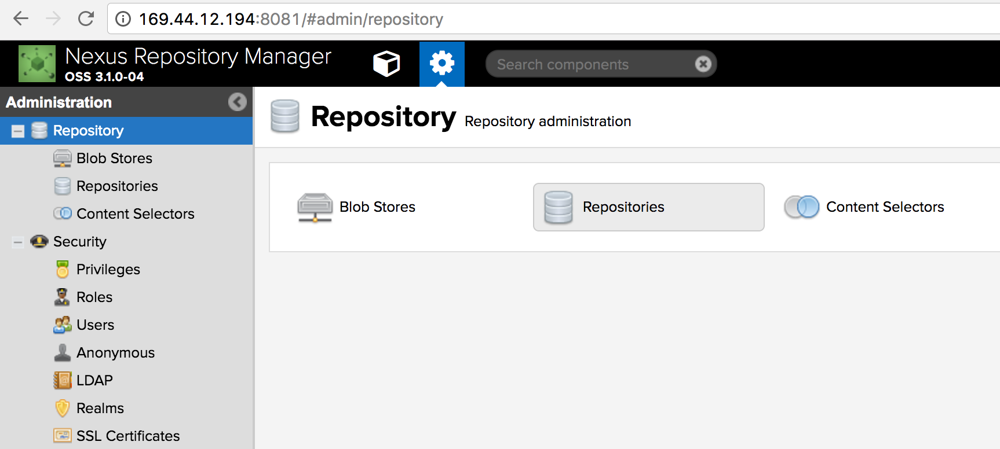
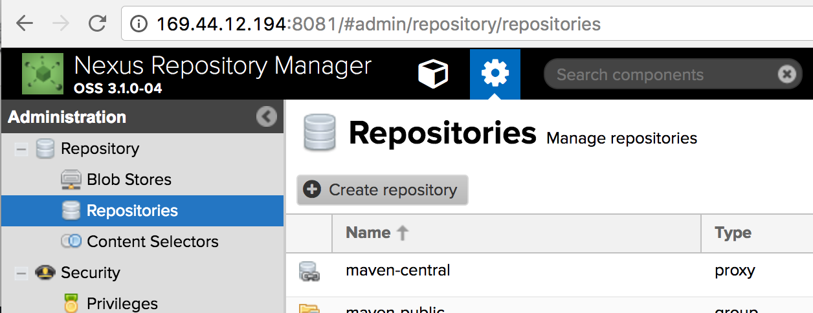
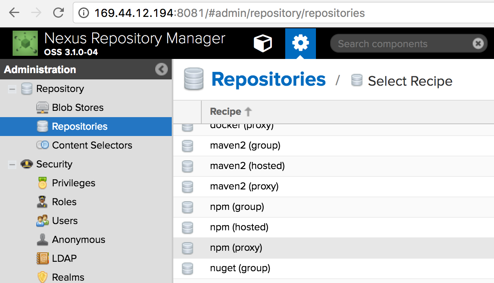
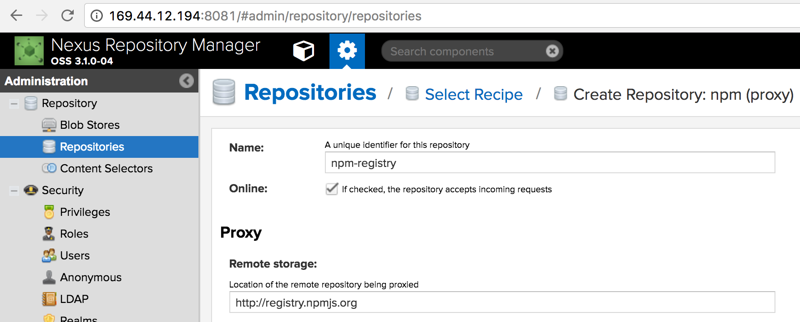
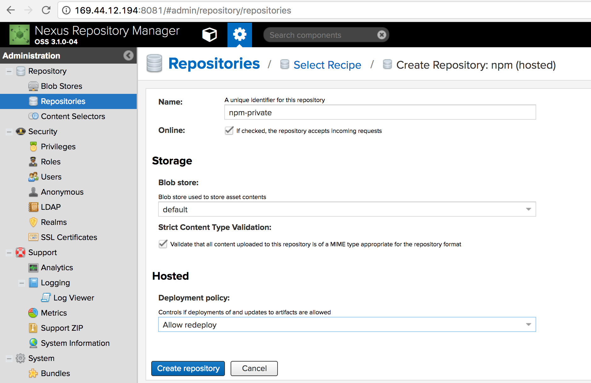
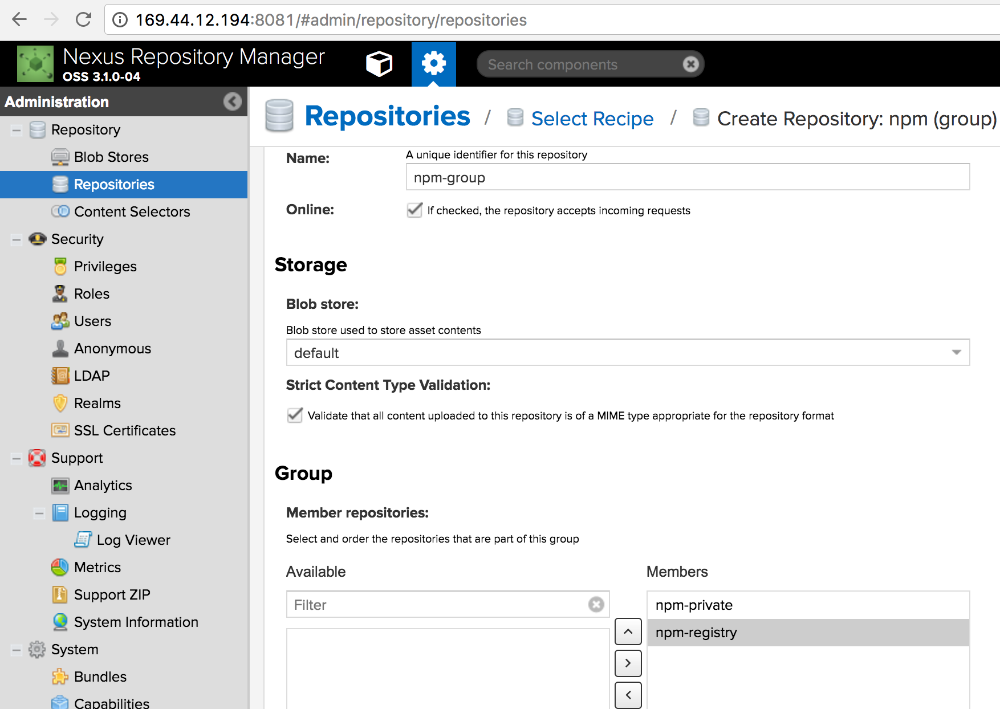
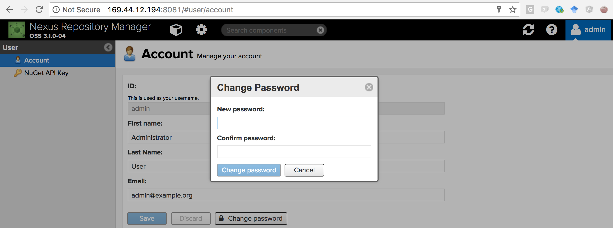
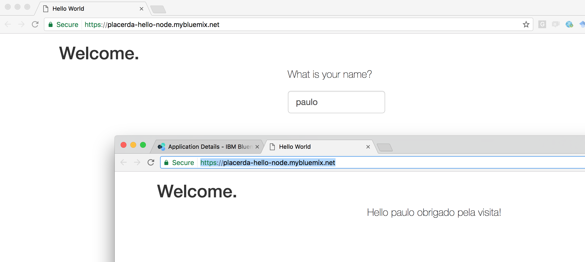

# Criando repositórios npm privados no Bluemix

Se você quer compartilhar módulos Node.js com outras aplicações na sua organização, porém não quer publicar no registro npmjs.com porque ele é público, aqui você verá baseado em exemplos como criar um repositório npm privado no Bluemix utilizando um container com o Nexus.

## Pre-requisitos

Para realizar os passos descritos neste tutorial é necessário uma conta [Bluemix](https://console.ng.bluemix.net/registration/) e uma estação de trabalho com os seguintes componentes instalados: [Cloud Foundry CLI](https://github.com/cloudfoundry/cli#downloads), [Docker](https://docs.docker.com/engine/installation/), [Bluemix CLI](http://clis.ng.bluemix.net/ui/home.html), [Bluemix Container Service plugin](https://console.ng.bluemix.net/docs/containers/container_cli_cfic_install.html), [Git](https://git-scm.com/downloads) e o [Node.js](https://nodejs.org/en/).

## 1. Rodando o Nexus em um container no Bluemix

Inicialmente abra um terminal na sua estação de trabalho e faça o login no Bluemix pela linha de comando informando o API endpoint e seu e-mail/senha.

```
$ bx login
```

Durante o login será solicitado o API endpoint, a conta, organização e espaço em que você quer logar. Escolha os valores correspondentes a área em que você quer criar o container, para o API endpoint você pode selecionar https://api.ng.bluemix.net que é o endpoint da região do Bluemix em Dallas.

Em seguida copie a imagem do Nexus 3 no Docker Hub para seu registro privado no Bluemix.

```
$ bx ic cpi sonatype/nexus3 registry.ng.bluemix.net/<seu_namespace>/nexus3
```

\* substitua &lt;seu_namespace&gt; pelo nome do namespace da sua organização no Bluemix.

Após copiar a imagem utilize o seguinte comando para rodar o container.

```
$ bx ic run -p 8081:8081  --name nexus3 registry.ng.bluemix.net/<seu_namespace>/nexus3:latest
```

Obtenha um IP público para acesso ao Nexus

```
$ bx ic ip request
```

Associe o ip obtido com comando anterior ao container em execução

```
$ bx ic ip bind <endereco_ip> nexus3
```

Aguarde um momento para o container iniciar e em seguida utilize o browser através do endereço:

```
http://<endereco_ip>:8081
```

Faça o login com usuário e senha admin/admin123



Crie os repositórios npm selecionado a opção Repositories e em seguida Create repository





Selecione a opção npm (proxy), esse repositório será um cache para o npm público, que será preenchido de acordo com a demanda.



Preencha as informações de name e url do repositório remoto de acordo com a figura abaixo:



Ainda nesta estapa crie um repositório npm (hosted) que será seu repositório privado, baseado na seguinte configuração:



Note que allow redeploy está selecionado, para que você consiga fazer o redeploy de um mesmo módulo.

Crie um repositório npm (group) para centralizar os dois repositórios criados anteriormente, para isso adicione os dois repositórios criados anteriormente como membros do grupo, como mostrado a seguir:



Pronto! está criado seu repositório npm privado rodando em uma instalação Nexus no Bluemix, nas próximas partes deste post você verá como configurar suas aplicações para publicar módulos neste repositório e como apontar suas aplicações para utilzar os módulos que estão publicados lá.

OBS: neste momento, para melhorar a segurança você pode alterar a senha do usuário admin para que ele não fique com a senha default, para isso basta selecionar o usuário admin no canto superior direito e em seguida alterar a senha.



## 2. Publicando um módulo de exemplo

Nesta seção você verá o passo-a-passo para criar e em seguida publicar um módulo simples de exemplo no repositório privado que acabou de criar.

Inicialmente crie uma pasta meumodulo, na qual você concentrará os arquivos do seu módulo.

Crie um package.json com o seguinte conteúdo, esse arquivo contém o nome do módulo que será publicado mais a frente:

```
{
  "name" : "meumodulo",
  "version" : "0.0.1",
  "description" : "Modulo privado de exemplo",
  "main" : "index.js",
  "publishConfig": {
    "registry": "http://169.44.12.194:8081/repository/npm-private/"
  }
}
```

Crie um arquivo index.js, este arquivo contém a implementação do módulo a ser publicado.

```
module.exports = {
  hello: function(nome) {
    return String(nome + 'obrigado pela visita');
  }
};
```

Obtenha o código base64 correpondente ao par usuário:senha no repositório npm, o comando a seguir exemplifica como obter este código para o usuário admin e senha123:

```
$ echo -n 'admin:admin123' | openssl base64
```

Anote o resultado do comando, que será algo do tipo YWRtaW46YWRtaW4xMjM= para ser usado na configuração do repositório no seu módulo.

Crie um arquivo .npmrc com as informações de acesso ao repositório, este arquivo será usado pelo npm se autenticar no repositório privado.

```
registry=http://<endereco_ip>:8081/repository/npm-private/
_auth=YWRtaW46YWRtaW4xMjM=
email=admin@example.org
```
OBS: substituir o <endereco_ip> pelo endereço ip do projeto do container com o Nexus, atribuir o código base64 como valor de \_auth e o email do usuário no repositório npm.

Pronto, agora é só publicar o módulo

```
$ npm publish
+ meumodulo@0.0.1
```

## 3. Consumindo o módulo

Depois que seu repositório privado está configurado e com um módulo publicado você pode começar a utilizá-lo em suas apliações, nesta seção é utilizado um projeto Hello World de exemplo para ilustrar como fazer isso.

Abra o terminal em sua estação de trabalho e clone um projeto hello world node disponível no github:

```
$ git clone https://github.com/IBM-Bluemix/node-helloworld
```

Entre no diretório da aplicação

```
$ cd node-helloworld
```

Crie  um arquivo .npmrc similar ao utilizado no projeto do módulo que foi publicado, porém apontando para o repositório **npm-group**. Neste exemplo utilizaremos o mesmo usuário (admin), para um caso real recomendo criar um usuário específico para consumo que tenha direito de leitura apenas ao repositório.

.npmrc

```
registry=http://<endereco_ip>:8081/repository/npm-private/
_auth=YWRtaW46YWRtaW4xMjM=
email=admin@example.org
```

Altere o conteúdo do arquivo server.js para:

```
var express = require("express"),
    app = express();
var meumodulo = require("meumodulo");

var port = process.env.PORT || 8080;

app.use(express.static(__dirname + '/public'));

app.get("/sayHello", function (request, response) {
  var user_name = request.query.user_name;
  user_name = meumodulo.hello(user_name);
  response.end("Hello " + user_name + "!");
});

app.listen(port);
console.log("Listening on port ", port);
```

Repare que incluímos o módulo meumodulo no programa (meumodulo = require("meumodulo");) e também utilizamos a função hello deste módulo para alterar a variável user_name.

Na sequência atualize o arquivo package.json para incluir a dependência com o módulo meumodulo, como indicado abaixo:

```
{
  "name": "bluemix-hello-node",
  "version": "0.0.0",
  "dependencies": {
    "commander": "^2.6.0",
    "express": "^4.14.1",
    "http-post": "^0.1.1",
    "http-proxy": "^1.8.1",
    "meumodulo": "latest"
  },
  "main": "server.js",
  "scripts": {
    "start": "node server.js"
  }
}

```

Atualize o arquivo manifest.yml para informar um nome de host específico para esta app, evitando  conflitos de nomes com outras apps, no meu caso utilizei placerda-hello-node como nome do host, como pode ser visto abaixo:

```
---
applications:
- name:    hello-node
  host:    placerda-hello-node
  memory:  128M

```

Pronto! Agora basta fazer o push da ua aplicação do Bluemix e testar o resultado.

```
$ cf push hello-node

```



## 4. Observações Finais

Como sugestões de melhoria para a configuração realizada através do procedimento descrito aqui ficam as seguintes ações:

- criar uma toolchain para publicar o módulo direto de um delivery pipeline no Bluemix.

- inclusão de certificados de criptografia na comunicação com o repositório, isso pode ser realizado de acordo com as instruções deste [link](https://books.sonatype.com/nexus-book/3.0/reference/security.html#ssl-inbound).

- utilização de um volume externo para evitar o armazenamento do conteúdo no storage local do próprio container, nesta [referência](https://console.ng.bluemix.net/docs/containers/container_volumes_ov.html#container_volumes_ov) há mais informações sobre como fazer isto.
